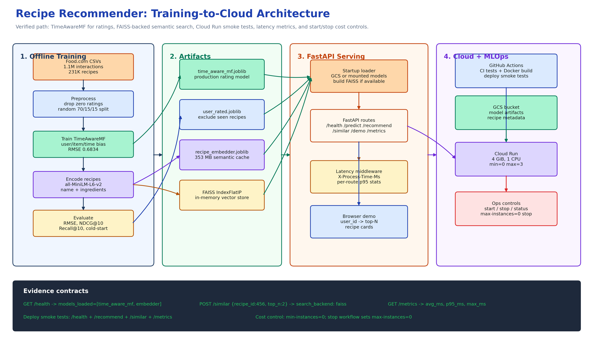
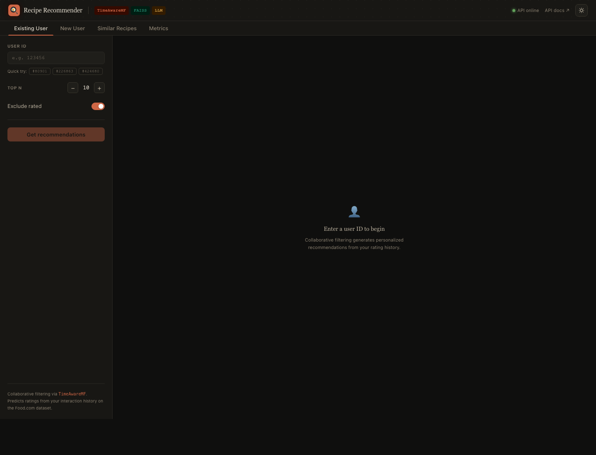

# Recipe Recommender: Time-Aware Collaborative Filtering + LLM Embeddings

[](https://github.com/KrisDcosta/CSE258_A2/actions/workflows/ci.yml)
[](https://github.com/KrisDcosta/CSE258_A2/actions/workflows/deploy.yml)

Rating prediction and top-N recommendation on 1.1M Food.com interactions (231K recipes,
2000–2018). The project has two threads: (1) benchmark integrity — fixing a broken
evaluation split and verifying zero-rating semantics; (2) model progression from global
mean → time-aware MF, with hybrid MF + LLM content embeddings evaluated as an
experimental extension.

## Results

Zero-rated interactions dropped: Food.com allows reviews without an explicit star rating —
these appear as 0 in the export and are not 1-star reviews. See [`FINDINGS.md`](FINDINGS.md)
for the full benchmark-integrity narrative.

### Verified warm-start evaluation (random 70/15/15 split)

These values are from the current reproducible pipeline after dropping Food.com zero-rating
rows and splitting with seed 42.

| Model | Test RMSE | NDCG@10 | Recall@10 |
|-------|----------:|--------:|----------:|
| Global mean baseline | 0.7251 | - | - |
| Recipe mean baseline | 0.7677 | - | - |
| Time-aware MF (SGD, k=5, λ=0.02) | **0.6834** | **0.2252** | **0.3153** |
| Hybrid MF + LLM embeddings | 0.7039 | 0.2180 | 0.3074 |

The verified CLI run is exported in [`results/phase3_metrics.json`](results/phase3_metrics.json).
The current production service loads this MF artifact plus the recipe embedder used by
`/similar`. The real full-data hybrid run is exported in
[`results/hybrid_metrics.json`](results/hybrid_metrics.json), but it is not the
production default because it underperformed time-aware MF.

### Data and split

| Quantity | Value |
|----------|------:|
| Raw interactions | 1,132,367 |
| Raw recipes | 231,637 |
| Zero-rated rows dropped | 60,847 |
| Zero-rated share | 5.4% |
| Train rows | 750,064 |
| Validation rows | 160,728 |
| Test rows | 160,728 |
| Best validation RMSE | 0.6808 |

### Cold-start breakdown for deployed model

| Item bucket | Test rows | RMSE |
|-------------|----------:|-----:|
| Cold, fewer than 5 training interactions | 67,249 | 0.7195 |
| Medium, 5-19 training interactions | 45,498 | 0.6426 |
| Warm, at least 20 training interactions | 47,981 | 0.6688 |

### Statistical validation (Section 7)

The notebook includes the bootstrap/paired-test framework for model comparisons. The
repo-visible production metrics above are the concrete values verified by the current
CLI/API/Docker/Cloud Run path.

## Key Findings

- **Broken benchmark diagnosed**: Kaggle split had no recipe overlap — item-CF collapsed to global mean predictions. Random split restored overlap and validated CF models.
- **Zero ratings verified**: 60,847 entries (5.4%) are 0. Food.com confirmed: no star submitted ≠ 1-star review. Both pipelines documented.
- **Rating drift is real**: average rating fell ~0.4 points 2002→2014, partially recovered — time bins capture signal static MF misses.
- **Time-aware improvement is statistically significant**: bootstrap CI and paired t-test confirm the gap is not sampling noise.
- **LLM embeddings add semantic content signal**: all-MiniLM-L6-v2 on recipe name + ingredients captures similarity that bag-of-words can miss.
- **FAISS powers scalable semantic search**: `/similar` uses a FAISS IndexFlatIP vector store when available, with a brute-force fallback for local platforms without FAISS wheels.
- **Cold-start recommendations are user-facing**: `/recommend/new-user` builds a semantic profile from liked/disliked recipe IDs and preference chips, so the demo works without knowing a historical Food.com `user_id`.
- **Hybrid architecture was evaluated honestly**: the implemented hybrid combines TimeAwareMF scores with all-MiniLM-L6-v2 recipe embeddings, but the full run underperformed the simpler time-aware model, so it remains opt-in.
- **Production path verified end-to-end**: CLI training writes model artifacts, FastAPI serves predictions, `/demo` provides a browser UI, `/metrics` reports latency, GitHub Actions deploys to Cloud Run, and live smoke tests verify the deployed service.

## Architecture



Source: [`docs/architecture.excalidraw`](docs/architecture.excalidraw)

## Live Demo

Live app: [`/demo`](https://recipe-recommender-tyhw3omfqq-uc.a.run.app/demo)



The demo is a single-page app served by FastAPI. It exposes four operational paths:

- **Existing User**: calls `/recommend` with a Food.com `user_id` and returns TimeAwareMF top-N recommendations.
- **New User**: calls `/recommend/new-user` using liked/disliked recipe IDs and preference chips, then retrieves semantic cold-start recommendations from FAISS.
- **Similar Recipes**: calls `/similar` to search the recipe embedding index.
- **Metrics**: calls `/metrics` and displays route counts plus average, p95, and max latency.

Recipe cards can call `/explain`. In the deployed service, xAI is enabled through Google
Secret Manager and Cloud Run `--set-secrets`; if the provider is unavailable, the backend
falls back to deterministic rule-based explanations. No API key is present in frontend code.

## System Flow

```text
Food.com RAW_interactions.csv + RAW_recipes.csv
  -> data validation and preprocessing
  -> zero-rating cleanup and train/validation/test split
  -> TimeAwareMF training for rating prediction
  -> recipe text embedding generation
  -> model, user history, embedder artifacts saved as .joblib
  -> artifacts uploaded to GCS
  -> GitHub Actions builds Docker image and deploys Cloud Run
  -> FastAPI downloads artifacts at startup
  -> FAISS IndexFlatIP is built in memory when available
  -> /recommend, /recommend/new-user, /similar, /explain, /metrics, /demo serve users
```

This keeps the project scoped to the Food.com dataset while still presenting a realistic
MLOps system: reproducible training, artifact handoff, cloud serving, semantic retrieval,
LLM explanation, latency monitoring, and cost controls.

## Project Structure

```
.
├── assignment2_1.ipynb     # analysis notebook: EDA → models → evaluation
├── FINDINGS.md             # benchmark integrity, zero-rating, drift, cold-start narrative
├── .github/workflows/      # CI and Cloud Run deployment workflows
├── app/                    # FastAPI inference service
│   ├── main.py             # startup model loading, /health
│   ├── demo.py             # browser demo route
│   ├── demo_assets/        # integrated single-page recommender UI
│   ├── schemas.py          # Pydantic request/response schemas
│   └── routers/            # /predict, /recommend, /recommend/new-user, /similar, /explain, /metrics
├── scripts/                # reproducible training/evaluation CLIs
│   ├── train.py
│   ├── evaluate.py
│   └── embed_recipes.py
├── src/
│   ├── data.py             # load_interactions, load_recipes, preprocess, drop_zero_ratings
│   ├── splits.py           # random_split, temporal_split, SplitResult
│   ├── models.py           # BaseMF, StaticMF, TimeAwareMF (fit/predict/save/load)
│   ├── metrics.py          # rmse, ndcg_at_k, recall_at_k, bootstrap_ci, paired_ttest
│   ├── embeddings.py       # RecipeEmbedder (sentence-transformers), build_embedding_features
│   └── hybrid.py           # HybridMF = TimeAwareMF + LLM embeddings → Ridge
├── tests/                  # pytest suite — no real data required
│   ├── conftest.py         # synthetic fixtures
│   ├── test_data.py
│   ├── test_splits.py
│   ├── test_models.py
│   ├── test_metrics.py
│   ├── test_embeddings.py
│   └── test_hybrid.py
├── results/
│   ├── phase3_metrics.json # committed summary of verified production model
│   └── hybrid_metrics.json # evaluated hybrid extension metrics
├── docs/
│   ├── architecture.excalidraw
│   ├── architecture.png
│   ├── demo.png            # live UI screenshot
│   ├── deployment.md       # CI/CD, Cloud Run, and GCS artifact setup
│   └── monitoring.md       # latency metrics, Cloud Logging, and cost controls
├── models/                 # saved model artifacts (not in git)
├── data/dataset/           # RAW_recipes.csv + RAW_interactions.csv (not in git)
├── Dockerfile
├── docker-compose.yml
├── cloudbuild.yaml
├── pyproject.toml
└── requirements.txt
```

## Setup

```bash
# 1. Install dependencies
python -m venv .venv && source .venv/bin/activate
pip install -e ".[dev,api,embeddings]"

# 2. Download dataset from Kaggle → data/dataset/
# https://www.kaggle.com/datasets/shuyangli94/food-com-recipes-and-user-interactions

# 3. Run tests (no dataset needed)
pytest tests/ -v

# 4. Run notebook
jupyter lab assignment2_1.ipynb
```

Run cells top-to-bottom from repo root. Data loading (~30s), Item-CF (~10min), MF training (~15min),
LLM embedding (~2–3 min on CPU, cached after first run).

## Production Pipeline

Train and evaluate from the command line:

```bash
python scripts/train.py --model time_aware --data-dir data/dataset --output-dir models
python scripts/evaluate.py --model models/time_aware_mf.joblib --data-dir data/dataset --output results/time_aware_eval.json
python scripts/embed_recipes.py --data-dir data/dataset --output models/recipe_embedder.joblib
```

The training pipeline writes `models/time_aware_mf.joblib` plus
`models/user_rated.joblib`, which the API uses to exclude recipes already rated by a
user. The recipe embedder is generated separately and enables `/similar`. Hybrid can be
trained with `--model hybrid`, but it is not the default deployed model unless
`MODEL_NAME=hybrid_mf` is set intentionally.

Run the API locally:

```bash
uvicorn app.main:app --reload --port 8000
curl http://localhost:8000/health
curl -X POST http://localhost:8000/predict \
  -H "Content-Type: application/json" \
  -d '{"user_id": 123, "recipe_id": 456, "date": "2015-06"}'
curl -X POST http://localhost:8000/recommend \
  -H "Content-Type: application/json" \
  -d '{"user_id": 123, "top_n": 10, "exclude_rated": true}'
curl -X POST http://localhost:8000/similar \
  -H "Content-Type: application/json" \
  -d '{"recipe_id": 456, "top_n": 5}'
curl -X POST http://localhost:8000/recommend/new-user \
  -H "Content-Type: application/json" \
  -d '{"liked_recipe_ids": [456], "disliked_recipe_ids": [], "top_n": 5}'
curl -X POST http://localhost:8000/explain \
  -H "Content-Type: application/json" \
  -d '{"user_id": 123, "top_n": 2}'
curl http://localhost:8000/metrics
# Browser demo
open http://localhost:8000/demo
```

Run with Docker Compose after training artifacts exist in `models/`:

```bash
docker compose up --build
curl http://localhost:8080/health
```

Verified serving stack:

```text
pytest: 162 passed, 2 skipped
FastAPI /health: 200 OK
Docker Compose /health: 200 OK
Loaded model artifacts: time_aware_mf, embedder
Docker vector backend: faiss
```

## CI/CD and Cloud Run

Live API:

```text
https://recipe-recommender-tyhw3omfqq-uc.a.run.app
```

Current status: on April 28, 2026, GitHub Actions deployed the 4 GiB Cloud Run revision
from commit `846d1d4`.
The workflow smoke-tests `/health`, `/recommend`, `/recommend/new-user`, `/similar`,
and `/metrics`. The browser demo is available at
[`/demo`](https://recipe-recommender-tyhw3omfqq-uc.a.run.app/demo).
Manual post-deploy validation also verified `/demo` and `/explain`.

Smoke test:

```bash
curl https://recipe-recommender-tyhw3omfqq-uc.a.run.app/health
curl -X POST https://recipe-recommender-tyhw3omfqq-uc.a.run.app/predict \
  -H "Content-Type: application/json" \
  -d '{"user_id": 123, "recipe_id": 456, "date": "2015-06"}'
curl -X POST https://recipe-recommender-tyhw3omfqq-uc.a.run.app/similar \
  -H "Content-Type: application/json" \
  -d '{"recipe_id": 456, "top_n": 2}'
curl -X POST https://recipe-recommender-tyhw3omfqq-uc.a.run.app/recommend/new-user \
  -H "Content-Type: application/json" \
  -d '{"liked_recipe_ids": [456], "top_n": 2}'
curl -X POST https://recipe-recommender-tyhw3omfqq-uc.a.run.app/explain \
  -H "Content-Type: application/json" \
  -d '{"liked_recipe_ids": [456], "recommendations": [{"recipe_id": 153501, "name": "easy dal", "score": 0.9415}], "top_n": 1}'
curl https://recipe-recommender-tyhw3omfqq-uc.a.run.app/metrics
```

Verified `/similar` response:

```json
{
  "seed_recipe_id": 456,
  "search_backend": "faiss",
  "similar": [
    {"recipe_id": 153501, "name": "easy dal", "similarity": 0.9415},
    {"recipe_id": 81727, "name": "yellow lentil dal", "similarity": 0.9411}
  ]
}
```

GitHub Actions workflows live in `.github/workflows/`:

- `ci.yml`: runs package imports, pytest, and Docker image build checks on pull requests and pushes to `main`.
- `deploy.yml`: builds the runtime image, pushes it to Artifact Registry, deploys to Cloud Run on pushes to `main`, then smoke-tests `/health`, `/recommend`, `/recommend/new-user`, `/similar`, and `/metrics`.
- `cloud-control.yml`: manual `status`, `start`, and `stop` controls for the Cloud Run service. `stop` sets max instances to `0`; `start` restores max instances to `RUN_MAX_INSTANCES` or `3`.

Cloud Run loads both MF and embedder artifacts from GCS at startup when local mounted
files are absent. `/health` reports `time_aware_mf` and `embedder` when both artifacts
are available. `MODEL_NAME` defaults to `time_aware_mf`; set `MODEL_NAME=hybrid_mf`
only after hybrid metrics beat the production model. The deploy workflow uses 4 GiB
memory because the model + embedder footprint can exceed 2 GiB.
LLM explanations are optional. If `ENABLE_LLM_EXPLANATIONS=true` and `XAI_API_KEY` is
available, `/explain` calls the configured xAI-compatible chat endpoint; otherwise it
returns deterministic rule-based explanations.
See [`docs/monitoring.md`](docs/monitoring.md) for latency metrics, logging queries,
recommended alerts, and cost-control operations.
See [`docs/deployment.md`](docs/deployment.md) for required GitHub secrets, repository
variables, GCS artifact layout, and the optional Cloud Build path.

## Resume Bullets

- Built and deployed an end-to-end recipe recommender on 1.1M Food.com interactions and 231K recipes, improving RMSE from a 0.7251 global baseline to 0.6834 with time-aware matrix factorization.
- Diagnosed benchmark leakage and data-quality issues, including a broken item-CF split and 60,847 zero-rating rows, then documented corrected evaluation with RMSE, NDCG@10, Recall@10, bootstrap CI, and paired tests.
- Productionized the model with FastAPI, Docker, GitHub Actions, Artifact Registry, GCS artifacts, and Cloud Run; added deployed smoke tests for health, recommendations, semantic search, and latency metrics.
- Added FAISS-backed semantic recipe retrieval, cold-start onboarding recommendations, xAI-powered explanation support through Secret Manager, and a browser demo that exposes existing-user, new-user, similar-recipe, and monitoring workflows.

## Notebook Sections

| Section | Content |
|---------|---------|
| 1. Data Loading & Preprocessing | Load, parse nutrition, merge, 70/15/15 split |
| EDA | Rating distributions, 18-year time trend, cold-start analysis |
| 2. Baseline Models | Recipe mean, Item-CF, linear regression, TF-IDF Ridge, static MF |
| 3. Time-Aware MF | SGD with user×time and item×time bias terms |
| 4. Results Comparison | RMSE table, all models |
| 5. Temporal Evaluation | Train < 2015 / test ≥ 2015, cold-start breakdown, RMSE gap |
| 6. Ranking Metrics | NDCG@10, Recall@10, sampled negatives, static vs time-aware |
| 7. A/B Statistical Framework | Bootstrap CI, paired t-test, Cohen's d, would-deploy decision |
| 8. LLM Semantic Embeddings | all-MiniLM-L6-v2 embeddings, LLM Ridge, Hybrid MF+LLM, similar-recipe explorer |

## Course

CSE 258R: Recommender Systems & Web Mining · UC San Diego · Fall 2025
